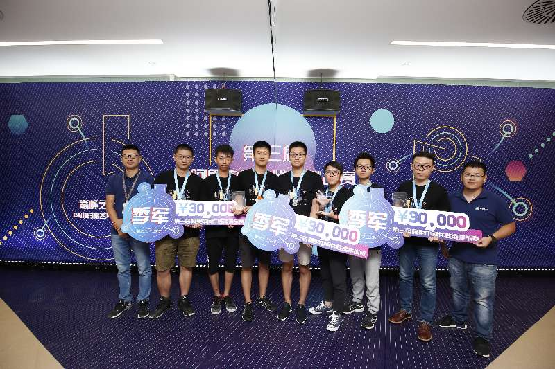
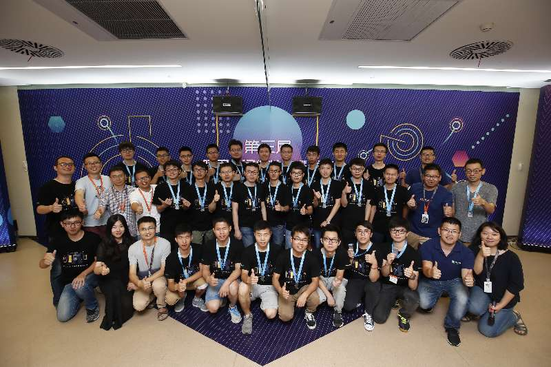
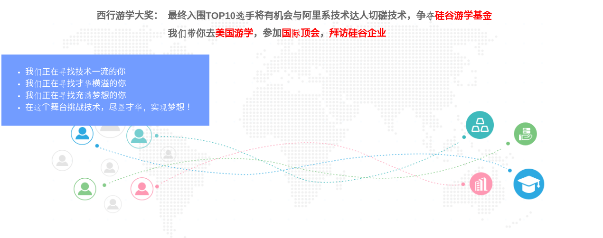

# 第三届阿里中间件性能挑战赛总结

## 喜讯

香港科技大学的rapids团队(右二：王立鹏，右三：车煜林)获得季军。

rapids团队(左一：王立鹏，左二：车煜林)与评测环境负责人(左三：万少)合影。

## 比赛介绍

比赛分为初赛(有关消息引擎)，复赛(有关数据库重放和范围查询)，最终答辩。其中，top100队伍进入复赛,复赛top10队伍进入最终答辩。

初赛和复赛考察了选手算法设计, 工程实现，性能调优的能力，要求选手对消息引擎和数据库重放和范围查询有比较深入的理解，并且能够分析出系统的性能瓶颈进行针对性的优化。

比赛的奖金非常诱人。

比赛的评委非常权威, 对中间件，数据库有深入理解。

最终进入答辩top10队伍与评委以及组织者进行了合影。

此外，此次比赛引入了额外的24小时极客pk赛(考察分布式数据库的`top k,n`查询)。极客pk赛的激励也非常诱人，top10队伍的选手们在24h内，竞争3个西行游学名额。

## 初赛介绍

### 赛题要求

在单机环境下，实现带有持久化的消息队列引擎，由第一个生产进程产生消息队列，并在生产线程最终退出时候，保证安全地持久化到磁盘；之后由另一个消费进程进行消息队列的消费。题目中，产生出的消息总量为40,000,000条，消息的平均大小100B。对于同一个生产者，同一个命名空间的消息需要保证顺序性。对于产生者，选手需要实现创建消息，发送消息，消息落盘相关的方法。对于消费者，选手需要实现命名空间绑定和消费相关的方法。

### 解题思路

题目中，产生出的消息总量为40,000,000条；如果在文件中消息不经过压缩，存所有信息所需的磁盘空间是4GB左右。但是测试环境的IO速度很不理想(30MB/s)，选手需要充分利用 linux 的 pagecache 来解决这个瓶颈。在linux中，pagecache sync相关有两个主要参数 `vm.dirty_background_ratio`(默认为10%)，`vm.dirty_ratio`(默认为20%)，当dirty page的大小达到了总物理内存大小的10%时，linux操作系统会进行刷盘但不阻塞系统调用的写线程，但若dirty page的大小达到了物理内存大小的20%的时候，写线程就会被阻塞。优化策略是减小最终消息队列序列化到文件的大小，这个可以通过压缩算法达到。另外，初赛给的计算资源少(4逻辑CPU核)，需要选择高效的压缩算法，并高效地实现消息的序列化与反序列化。

## 复赛介绍

### 赛题要求

进行数据库(从空开始)的主从增量同步，输入为10G顺序append的日志文件(只能单线程顺序读取1次，模拟真实流式处理场景)，所有输入文件在内存文件系统中；日志文件中包含增删改这三种类型的数据变化操作。最后的输出查询结果需要落盘在client端(大小约为38MB)，server和client是两台配置相同的16逻辑cpu核数的阿里云虚拟机。赛题数据为确定的一份单表日志，并且有字段的长度有确定的范围。比赛测试环境为多线程环境，需要解决并发问题，充分利用并行。

#### 解题思路

文件读取通过内存映射文件的方式，减少内核态和用户态拷贝。并行处理解析日志文本,保证重放顺序。建立好流水线，充分将IO和计算overlap在一起。网络传输和落盘采用Zero-Copy方式，减少内核态和用户态拷贝的开销。优化内存使用,减少小对象开销。实现内存友好并且高效的hashmap和hashset。

## 比赛感想和收获

### 比赛过程

本次比赛相当地激烈刺激。在初赛的比赛过程中，我们rapids团队开始做得比较晚，并且开始阶段一直没抓出比赛考察pagecache的这个点，做了许多对初赛题目无用的文件布局的优化。但我们没有放弃，在比赛的最后一天抓到了性能优化要点：即通过压缩，减少写盘大小，利用起pagecache来。在最后一天从100名开外到80名，再通过工程上的性能调优以及选择更高效的压缩算法snappy，最终升至32名，成功进入复赛。

复赛的过程相比初赛要顺利一些。但是整个过程一样惊心动魄，我们经历了好几次进入top10又被超越的情况。但是，我们顶住了压力，在最后一晚上保住了top10（复赛成绩第6名），成功晋级答辩环节。

### 比赛感想

此次比赛rapids团队积累了团队协作，快速迭代开发，代码库版本维护的经验，这对之后的组内合作也相当有帮助。并且，rapids团队学习了jvisualvm性能概要分析工具的运用，积累了快速分析性能瓶颈优化的经验，这也可借鉴到之后的科研中的性能调优上。当然，在团队协作中，一定会有一些分歧和情绪，但是我们rapids团队还是经受住了这些考验，在初赛中绝境求生，复赛中逆境求生，并努力在最终答辩中展现出自己最佳水平。

### 技术总结

经过初赛，我们明白了在rocketmq设计中pagecache的重要性，只有把文件读写的size压缩到pagecache对应大小才可以取得比较好的性能，学习到了一些快速的压缩算法，例如snappy和lz4。

复赛中，我们明白了内存访问的pattern的重要性，通过多位byte数组的方式访问会比较慢，而通过扁平化的存储会比较访存友好。在实际应用中，需要针对具体的数据库表字段进行相应的优化。并且，我们认识到了在java中，默认的`Object`继承会带来将近8byte的开销，并且jvm会进行8byte内存对齐，在设计小对象的时候要格外小心。

复赛中，另一个考察点是计算和IO的overlap，我们需要设计出来合适的并行计算流水线，解决一些相关的同步和并发控制问题，来取得比较好的性能。另外hashmap和hashset的具体内存layout对于性能的影响也非常大，java自带的基于拉链和转化拉链为红黑树的组织形式开销会比较大，hashmap的probing方式对于性能影响也很大。我们最终选择了从trove hashmap开地址的方式进行修改，利用了trove hashmap中基于knuth书本上的probing方式，可以取得不错的性能。

### 技术展望

在之后的开发中，也需要注意操作系统和语言底层vm实现相关的内容，才能取得比较理想的性能。我们通过阿里中间件的博客学习到了许多新的知识，之后需要多多关注业界的技术热点，从而自己提高工程能力，并且也可能从中找出数据库领域值得研究并且未被研究透的问题。

## 补充资料

比赛攻略可见

https://github.com/CheYulin/IncrementalSyncShaping/tree/master/comp_summary
