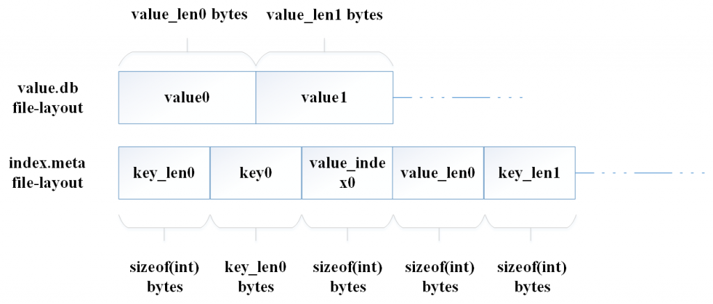

背景
---
---
[赛码会](http://www.qlcoder.com/contests/detail)是由[千里码](http://www.qlcoder.com/home)主办，网银互联赞助的面向国内程序员的工程竞赛。比赛选用题目脱胎于业界经典工程问题，旨在考察参赛者的综合工程实力。我在此次比赛中排名第8，在这里分享一下我的思路和代码。

题目简介  
---
---
* NoSQL，泛指非关系型的数据库，其中最典型的类型就是键值（Key-Value）存储数据库。这里是一个[Redis](http://redis.io/)的KV存储的GET和SET具体介绍：[get](http://redis.io/commands/get)，[set](http://redis.io/commands/set)。       
* 在这里你需要写一个相对精简的的持久化的KV存储，实现KV存储的2个基本函数`get`, `put`。为了简化问题的复杂性：     
	* Key和Value都是字符串类型。无须考虑多线程，保证单线程调用，因此在整个函数中你不需要使用锁，也不需要使用一些更适合并行计算的存储结构。    
	* 在整个用户请求的过程中，我们会模拟服务器断电将你的服务Kill(`kill -9`)并重启数次，重启后进程中原有的内存数据会丢失，因此使用文件系统作为数据存储是必需的。

测试数据介绍　　
---
---
* 测试数据主要分为三种类型，small/medium/large，在千里码的评测系统会以一个测试集合（比如small-1, small-2, small-3）为单位进行测试，计算对应的Query Per Second和Write Per Second。同一测试结合中的总get/put次数相同，但是比例不同，例如small-1为5w/5w的get/put，而small-2为1w/9w的get/put次数。
* 并且，small测试集合的内存限制为100MB/磁盘限制为1G，medium/large测试结合的内存限制为300MB/磁盘限制为10G。详细的测试数据信息表格如下：

测试数据 | Key | Value	| put数	| get数  | CPU限制	| 硬盘限制	| 内存限制
:--- |	:--- | :---	|  :---	| :---  | :---	|  :---	| :---
small-1 |	10~70 char | 	80~160 char	| 50,000	| 50,000  | 1核	| 1G	|  100MB
small-2 |	10~70 char | 	80~160 char	| 10,000	| 90,000  | 1核	| 1G	|  100MB
small-3 |	10~70 char | 	80~160 char	| 90,000	| 10,000  | 1核	| 1G	|  100MB
medium-1 |	10~300 char | 	1k~3k char	| 500,000	| 500,000  | 1核	| 10G	|  300MB
medium-2 |	10~300 char | 	1k~3k char	| 900,000	| 100,000  | 1核	| 10G	|  300MB
medium-3 |	10~300 char | 	1k~3k char	| 100,000	| 900,000  | 1核	| 10G	|  300MB
large-1 |		1k~3k char | 		10k~30k char	| 50,000	| 50,000  | 1核	| 10G	|  300MB
large-2 |		1k~3k char | 		10k~30k char	| 90,000	| 10,000  | 1核	| 10G	|  300MB
large-3 |		1k~3k char　| 		10k~30k char	| 10,000	| 90,000  | 1核	| 10G	|  300MB

比赛评判标准介绍
---
---
* 比赛中需要通过以上3个测试集合（9个测试数据），并且只计算get, put的时间，不计入构造函数里面初始化的时间，最后按照Query Per Second和Write Per Second进行积分。
* 但是构造函数的总调用时间要求在5s之内，构造函数在模拟断电程序重启时候被调用。
* 对任意一种类型的测试数据(small/medium/large)，要求对应程序在25s内运行结束。

针对小数据思路
---
---
* 小数据时候，包含Key-Value的Pair可以全放在内存里，然后比赛所需要的是，提供内存中的一个数据结构来支持快速的插入和快速的查询。可以选择的数据结构主要是平衡树(balanced tree)和散列表(hash table)，因为题目要求中说明Key-Value数据的产生是充分随机的，所以我选择了散列表，因为它期望意义上是常数时间的插入和查询时间复杂度。
* 在hash table实现的时候，我先是使用了C++11提供的unordered_map，发现效果并不好，所以我自己重新实现了一个yche_map。yche_map的思路如下：
	* yche_map会预先reserve好足够的桶(bucket)大小，来避免hash table的重建开销；
	* yche_map使用了C++11标准库提供的murmur hash函数对象，为了加速，只计算字符串的前８个byte；
	* yche_map应用了线性探查(linear probing)，而非开散列的方式，主要是为了提高cache locality；
	* yche_map对于key和value，使用了它们的move constructor，目的是避免直接拷贝，而是直接转移指针的所有权(基于put到yche_map的时候，原来的Key, Value都不再被使用的事实)。
* 另外，题目要求说明需要保证数据的一致性，也就是说，在内存中数据更新的时候，也要反应在磁盘上，但是由于题目不是严格的断电，而是通过`kill -9`来模拟断电，所以我采用了mmap将磁盘中的数据映射到内存，通过memcpy将hash table中的数据拷贝过去，mmap使得用户空间可以和内核空间共享内存，所以效率很高。在内核态的时候，数据可以被正常flush到磁盘(当然，仅仅在当前的题目设定下)，所以正确性可以保证。

针对小数据的评测结果
---
---
评测结果中QPS和TPS为比赛中的积分，小数据测试集合的QPS/TPS结果分别为145w和80w。详细数据如下表所示：

Memory | Time | Disk Read	| Disk Write	| QPS/TPS  | Init Time
:--- |	:--- | :---	|  :---	| :---  | :---
23932KB | 182ms | 6389KB | 1448KB | 1445040/802228 | 46ms

针对小数据的C++代码
---
---
针对小数据的代码主要利用了mmap, memcpy和自己写的yche_map来达到全内存缓存快速KV存取和数据正确落盘的效果。详细代码请见[针对小数据代码Github链接地址](https://github.com/CheYulin/KeyValuePlay/blob/master/yche_cpp_codes/all_in_memory/mmap_impl_key_value.h)。

针对三种数据通用解法思路
---
---
* 与针对小数据解法不同， 针对三种数据通用解法需要考虑到内存中无法保存所有Key-Value信息的情况，但是通过观察题目的测试数据集可以发现，内存中可以存下所有的Key的信息。基于此，我设计了两个文件，一个来存value的index信息，取名为`index.meta`，另一个来存value的信息，取名为`value.db`。另外考虑到顺序访问磁盘的效率更高，所以我决定采用append的写文件模式。(经季大神提醒)，然后其实这种策略在存储引擎Bitcast中就有所应用，我搜索了一篇[Bitcast简介](http://www.cnblogs.com/sinaxyz/p/4199689.html)，大家可以了解一下。
	* 对于`value.db`文件，只需要顺序存储value string即可。
	* 而对于`index.meta`文件，需要保存的信息为: key的长度，key的值, value的index, value的长度。有了这四个信息之后，就可以恢复出从key到value_index, value_len的map，并且也不需要使用getline，因为此时，我们可以清楚地知道不同的数据对应的位置。在文件中，key_len, value_index和value_len都是从int对应的内存layout序列化成sizeof(int)个char来存储的。
	* 为了让大家更容易理解文件的layout，下面是file-layout的说明示意图。

* 当然内存中的hash table还是需要的，hash_table中包含的内容为key_string, value_index, value_length, value_string。其中，value_string为可选放入，也就是说，当内存够的时候可以放入，不够的时候不放入，作为一种value的缓存。hash table可以帮助我们判断某个key是不是存在，不存在可以直接返回"NULL"字符串，存在的话先判断是不是已经缓存了value_string，缓存了的话直接返回，反之去读文件。值得注意的是，在当前的实现中，我是按照value的个数来判断是否可以再插入的，已经在hash table中存在的key改变value时候可以让其插入，如果是一个新的key要插入时候，我会判断cur_cached_value_count是不是小于max_cached_value_count，若cur_cached_value_coun小于max_cached_value_count，则可以插入。
* 对于缓存的置换策略来讲，现在的这种实现是不太优化的，(经季大神提醒)，其实可以采用[LRU策略](http://www.cnblogs.com/dolphin0520/p/3749259.html)来优化缓存，之后会更新这一优化的实现，并进行对比。
* yche_map的实现类似于小数据的解法中实现。
*  然后读写文件是用ifstream, ofstream实现的(主要因为当时不太会用mmap, munmap, madvise)。

通用解法的评测结果
---
---
评测结果中QPS和TPS为比赛中的积分，下面的结果分别为：小数据120w+17w，中等数据16.5w+8.5w，大数据4.5w+1.5w。详细数据如下表所示。

Dataset | Memory | Time | Disk Read	| Disk Write	| QPS/TPS  | Init Time
:--- |	:--- | :---	|  :---	| :---  | :--- | :---
Small | 18760KB | 477ms | 568081KB | 7312KB | 1217694/175900	 | 174ms
Medium | 214708KB | 19878ms | 2534644KB | 1454295KB | 165418/88738  | 1204ms
Large | 285676KB | 16934ms | 3056752KB | 2745263KB | 46409/15153 | 1039ms

通用解法的C++代码
---
---
通用解法主要使用了ifstream, ofstream来进行数据落盘，利用了yche_map建立所有key和value_info的map，并且应用了value的内存缓存策略来加速查询。详细代码请见[针对三种数据通用解法代码Github链接地址](https://github.com/CheYulin/KeyValuePlay/blob/master/yche_cpp_codes/final_version/correct_final_key_value.h)。
